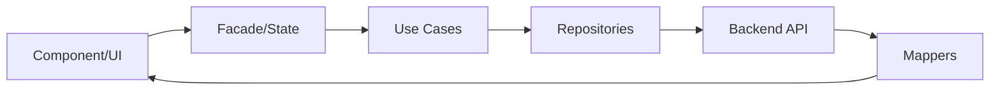

# Financial Product Management - Senior Frontend Architecture

Este repositorio contiene la solución técnica para el sistema de gestión de productos financieros. Se ha diseñado siguiendo principios de **Clean Architecture**, **SOLID** y **Programación Reactiva**, garantizando una base de código escalable, mantenible y altamente testable.

---

## Tabla de Contenidos
1. [Introducción](#-introducción)
2. [Arquitectura y Flujo de Datos](#-arquitectura-y-flujo-de-datos)
3. [Stack Tecnológico](#-stack-tecnológico)
4. [Estructura del Proyecto](#-estructura-del-proyecto)
5. [Guía de Inicio Rápido](#-guía-de-inicio-rápido)
6. [Estrategia de Testing](#-estrategia-de-testing)
7. [Principios de Ingeniería](#-principios-de-ingeniería)
8. [Performance y Optimización](#-performance-y-optimización)

---

##  Introducción
Aplicativo web empresarial diseñado para la administración integral del catálogo de productos financieros.

### Objetivo del Sistema
Proporcionar una interfaz técnica de alto rendimiento que garantice la integridad de los datos financieros mediante validaciones estrictas y una experiencia de usuario (UX) fluida, moderna y reactiva.

---

## Arquitectura y Flujo de Datos
Se ha implementado una variante de **Clean Architecture** adaptada al ecosistema de Angular, organizada por **Features (Feature-Sliced Design Lite)**.

### Flujo de Datos Unidireccional


1.  **Domain**: Contiene las reglas de negocio, modelos y contratos (Interfaces). Es agnóstico a cualquier infraestructura.
2.  **Application**: Orquesta el flujo de datos mediante **UseCases** y centraliza el estado en la **Facade**.
3.  **Infrastructure**: Implementa los detalles técnicos (Services, Repositories, Mappers, DTOs).
4.  **Presentation**: UI Pura y componentes inteligentes que reaccionan a Signals.

---

## 🛠 Stack Tecnológico
- **Angular (v21.2.0)**: Framework principal para aplicaciones robustas.
- **TypeScript (Strict Mode)**: Seguridad de tipos en tiempo de compilación.
- **Signals & RxJS**: Reactividad de vanguardia para gestión de estado y flujos asíncronos.
- **Vitest**: Motor de testing de alto rendimiento.
- **Vanilla SCSS (BEM)**: Diseño modular y responsivo sin deuda técnica de frameworks externos.

---

## Estructura del Proyecto
El proyecto sigue una organización por responsabilidades:

```bash
src/app/
├── core/               # Singleton Services (Interceptors, Guards, Toasts)
├── shared/             # UI Pura reutilizable (Buttons, Modals, Skeletons)
└── features/
    └── products/
        ├── domain/         # Modelos e Interfaces (Contratos)
        ├── application/    # UseCases y Facades (Lógica de Negocio)
        ├── infrastructure/ # Services, Repositories y Mappers
        └── presentation/   # Componentes, Páginas y Routing
```

---

## Guía de Inicio Rápido

### Requisitos Previos
- **Node.js**: v18.0.0 o superior
- **npm**: v10.0.0 o superior
- **Angular CLI**: v21.0.0+ (Opcional, se puede usar `npx ng`)

### Instalación
1. Clonar el repositorio.
2. Ir a la carpeta del frontend:
   ```bash
   cd frontend
   ```
3. Instalar dependencias:
   ```bash
   npm install
   ```

### Ejecución en Desarrollo
Para iniciar el servidor de desarrollo en `http://localhost:4200`:
```bash
npm start
```
*Nota: El proyecto está configurado con un proxy (`proxy.conf.json`) para redirigir las peticiones al backend local de forma transparente.*

### Construcción para Producción
```bash
npm run build
```
Los archivos optimizados se generarán en el directorio `dist/`.

---

## Estrategia de Testing
Se ha priorizado una pirámide de testing equilibrada enfocada en la lógica de negocio.

### Ejecución de Pruebas Unitarias
El proyecto utiliza **Vitest** por su velocidad y compatibilidad con Angular Signals.

* **Ejecutar todos los tests:**
  ```bash
  npm test
  ```
* **Ejecutar tests en modo Watch:**
  ```bash
  npx vitest
  ```
* **Generar reporte de cobertura:**
  ```bash
  npx vitest run --coverage
  ```

### Enfoque de Cobertura
- **UseCases**: 100% de la lógica operativa.
- **Mappers**: Validación de transformación de datos Backend -> Domain.
- **Facades**: Garantía del correcto flujo de estado y reactividad.

---

##  Principios de Ingeniería
*   **SOLID**: Aplicación rigurosa especialmente en SRP y OCP.
*   **Separation of Concerns**: Los componentes no conocen la existencia de la API.
*   **Inmutabilidad**: El estado se maneja como inmutable usando signals y operadores spread.
*   **Loose Coupling**: Uso de Inyección de Dependencias basada en el Repository Pattern.
*   **Dry Code**: Lógica compartida centralizada en servicios core.

---

## Performance y Optimización
- **ChangeDetectionStrategy.OnPush**: Implementada en todos los componentes para una detección de cambios ultra-eficiente.
- **TrackBy & Signals**: Optimización de renderizado en listas dinámicas.
- **Lazy Loading**: División de bundle por features para carga inicial rápida.
- **Tree Shaking**: Importación modular para reducir el tamaño del paquete final.

---

## Conclusión
Este proyecto representa un enfoque de **Ingeniería de Software Senior**, donde la mantenibilidad y la robustez técnica prevalecen sobre el desarrollo rápido e incremental. La arquitectura está lista para escalado horizontal y cambios de infraestructura con mínima fricción.

